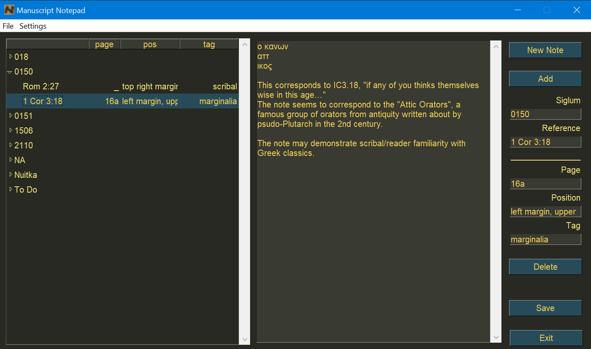

## Manuscript Notepad is a simple app for taking, storying, and organizing notes about manuscripts.

This is a tool I developed for my own use during my PhD research. It stores the notes in a JSON file for easy export and the GUI was designed with [PySimpleGUI](https://github.com/PySimpleGUI/PySimpleGUI) (tkinter). The only other dependency is `natsort`. The Windows executable was created with `nuitka`, which transcompiles Python to C and then to an executable.